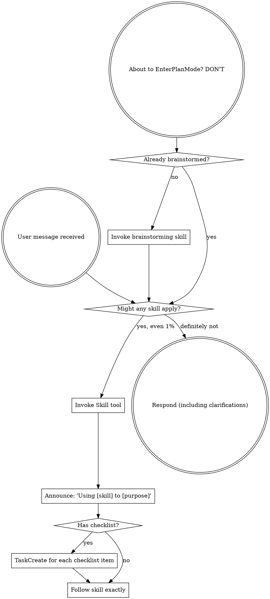

<SUBAGENT-STOP>
If you were dispatched as a subagent to execute a specific task, skip this skill.
</SUBAGENT-STOP>

<EXTREMELY-IMPORTANT>
If you think there is even a 1% chance a skill might apply to what you are doing, you ABSOLUTELY MUST invoke the skill.

IF A SKILL APPLIES TO YOUR TASK, YOU DO NOT HAVE A CHOICE. YOU MUST USE IT.

This is not negotiable. This is not optional. You cannot rationalize your way out of this.
</EXTREMELY-IMPORTANT>

## Instruction Priority

Superpowers skills override default system prompt behavior, but **user instructions always take precedence**:

1. **User's explicit instructions** (CLAUDE.md, direct requests) — highest priority
2. **Superpowers skills** — override default system behavior where they conflict
3. **Default system prompt** — lowest priority

If CLAUDE.md says "don't use TDD" and a skill says "always use TDD," follow the user's instructions. The user is in control.

## How to Access Skills

Use the `Skill` tool. When you invoke a skill, its content is loaded and presented to you—follow it directly. Never use the Read tool on skill files.

# Using Skills

## The Rule

**Invoke relevant or requested skills BEFORE any response or action.** Even a 1% chance a skill might apply means that you should invoke the skill to check. If an invoked skill turns out to be wrong for the situation, you don't need to use it.

## Red Flags

These thoughts mean STOP—you're rationalizing:

| Thought | Reality |
|---------|---------|
| "This is just a simple question" | Questions are tasks. Check for skills. |
| "I need more context first" | Skill check comes BEFORE clarifying questions. |
| "Let me explore the codebase first" | Skills tell you HOW to explore. Check first. |
| "I can check git/files quickly" | Files lack conversation context. Check for skills. |
| "Let me gather information first" | Skills tell you HOW to gather information. |
| "This doesn't need a formal skill" | If a skill exists, use it. |
| "I remember this skill" | Skills evolve. Read current version. |
| "This doesn't count as a task" | Action = task. Check for skills. |
| "The skill is overkill" | Simple things become complex. Use it. |
| "I'll just do this one thing first" | Check BEFORE doing anything. |
| "This feels productive" | Undisciplined action wastes time. Skills prevent this. |
| "I know what that means" | Knowing the concept ≠ using the skill. Invoke it. |

## Skill Priority

Subagents skip this skill — so this is the coordinating (main) session's routing map.

- Build something new ("let's build X"): brainstorming → writing-plans → execute. Execute either by working the plan yourself (executing-plans) or delegating it task-by-task to fresh subagents (subagent-driven-development) — writing-plans' completion step asks you which.
- Fix a bug (a reported defect): systematic-debugging → fix it under test-driven-development (a failing test that reproduces it, then the fix).

Implementation-time skills fire per task, during execution — not as top-level steps: test-driven-development (tests first) and domain skills like frontend-design / dataviz when a task builds UI or charts. On the delegate path these run inside the implementer subagent (carried by its task instructions).

When you delegate: the subagent gets ONE already-specified task and implements it — with TDD, and frontend-design/dataviz owning the task's layout/charts. It does not brainstorm or write plans (you did). It makes the task's own build choices; but a structural choice the plan never settled that reaches beyond this task — a shared data model, an API contract, a component boundary — it escalates back to you rather than guess (subagent-driven-development and the implementer prompt define when).

Run the decision skill your request selects — brainstorming for a build, systematic-debugging for a bug — before you build or fix; and per the invoke-skills-first rule at the top, use any relevant skill before you respond.

## Skill Types

**Rigid** (TDD, debugging): Follow exactly. Don't adapt away discipline.

**Flexible** (patterns): Adapt principles to context.

The skill itself tells you which.

## User Instructions

Instructions say WHAT, not HOW. "Add X" or "Fix Y" doesn't mean skip workflows.
